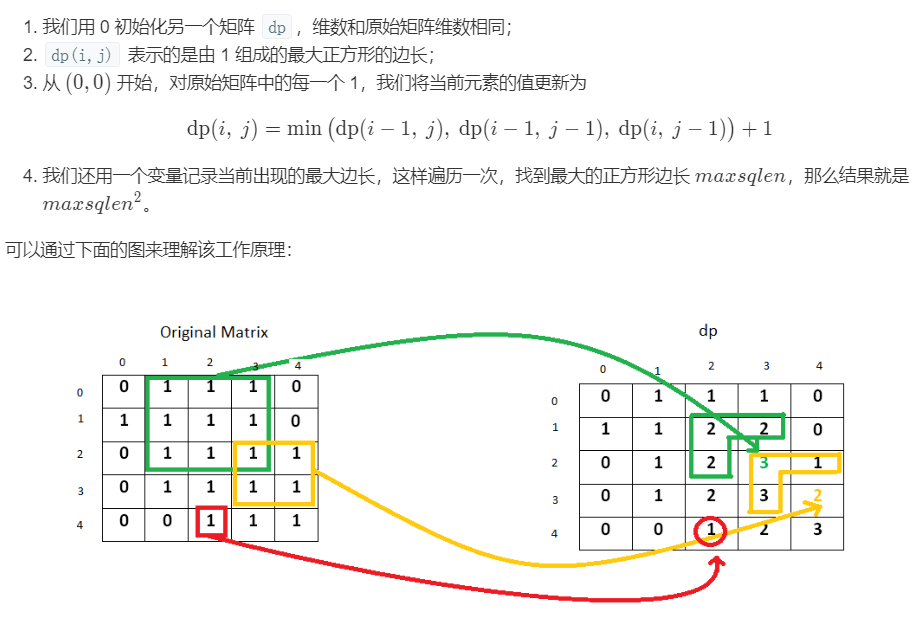

## 1277. Count Square Submatrices with All Ones

### Information

* TIME: 2020/01/17
* LINK: [Click Here](https://leetcode-cn.com/problems/count-square-submatrices-with-all-ones/)
* TAG: `DP`

### Description

> 给你一个 `m * n` 的矩阵，矩阵中的元素不是 `0` 就是 `1`，请你统计并返回其中完全由 `1` 组成的 **正方形** 子矩阵的个数。

### Example

```text
输入：matrix =
[
  [0,1,1,1],
  [1,1,1,1],
  [0,1,1,1]
]
输出：15
解释： 
边长为 1 的正方形有 10 个。
边长为 2 的正方形有 4 个。
边长为 3 的正方形有 1 个。
正方形的总数 = 10 + 4 + 1 = 15.

输入：matrix = 
[
  [1,0,1],
  [1,1,0],
  [1,1,0]
]
输出：7
解释：
边长为 1 的正方形有 6 个。 
边长为 2 的正方形有 1 个。
正方形的总数 = 6 + 1 = 7.

```

### My Answer

> 该题目与 [221. Maximal Square](https://github.com/ZhuoZhuoCrayon/my-Nodes/blob/master/Daily/LeetCode/20191101.md) 几乎相同
>
> 
>
> 某个坐标的**最大边长**，实际上也表示添加该点后，**增加的正方形子矩阵数**
>
> 通过求和可得正方形子矩阵数

```java
class Solution {
    public int countSquares(int[][] matrix) {
        if(matrix == null || matrix.length == 0)
            return 0;
        int m = matrix.length;
        int n = matrix[0].length;
        int sum = 0;
        int[][] dp = new int[m][n];
        
        for(int i = 0; i < m; i++){
            for(int j = 0; j < n; j++){
                if(i == 0 || j == 0){
                    dp[i][j] = matrix[i][j];
                }else{
                    if(matrix[i][j] != 0){
                        dp[i][j] = Math.min(dp[i - 1][j - 1], 
                                            Math.min(dp[i][j - 1], dp[i - 1][j])) + 1;
                    }else{
                        dp[i][j] = 0;
                    }
                }
                sum += dp[i][j];
            }
        }
        
        return sum;
    }
}
```

### Best Answer

> 空间压缩
>
> 下一状态指用到`(i-1,j-1)` `(i-1,j)` `(i,j-1)`三个状态
>
> - `(i-1,j)` -- `dp[j]`
> - `(i,j-1)` -- `dp[j-1]`
>
> 至于`(i-1,j-1)`，其实是被`(i,j-1)`覆盖了，所以在覆盖之前先行备份

```java
class Solution {
    public int countSquares(int[][] matrix) {
        if(matrix == null || matrix.length == 0)
            return 0;
        int m = matrix.length;
        int n = matrix[0].length;
        int sum = 0;
        int[] dp = new int[n];
        
        int record = 0;
        
        for(int i = 0; i < m; i++){
            for(int j = 0; j < n; j++){
                int tmp = dp[j];
                if(i == 0 || j == 0){
                    dp[j] = matrix[i][j];
                }else{
                    if(matrix[i][j] != 0){
                        dp[j] = Math.min(record, Math.min(dp[j - 1], dp[j])) + 1;
                    }else{
                        dp[j] = 0;
                    }
                }
                record = tmp;
                sum += dp[j];
            }
        }
        
        return sum;
    }
}
```

### Extend & Reference

> input any material

