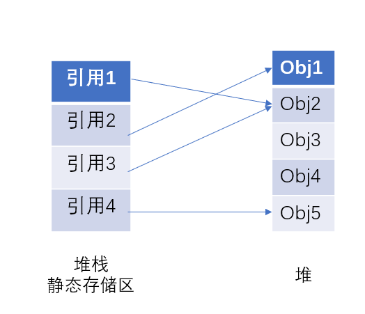

## 在构造器中调用构造器
> 为了避免重复写代码，可以在一个类中定义若干个构造器，在一个构造器中调用另一个构造器

```java
class Flower{
    private int val = 0;
    private String name = "init";
    Flower(){
    }
    Flower(int val){
        this.val = val;
    }
    Flower(String name){
        this.name = name;
    }
    Flower(int val,String name){
        this(val);
        this.name = name;
    }
    //error
    //一个构造器最多可调用自身其他构造器一次
    Flower(int val,String name){
        this(val);
        this(name);
    }
}
```
**注：** 一个构造器最多可调用自身其他构造器一次'

## 清理：终结处理和垃圾回收
> p88

### finalize()
> 垃圾回收器准备释放对象占用的存储空间时，会首先调用`finalize()`方法，并在下一次垃圾回收发生前才会真正回收占用内存

`finalize()`的误区
* `finalize()`不等于C++的析构函数
* 在java中的垃圾回收准则
    * 对象可能不被垃圾回收
    * 垃圾回收也不等于析构
    * 垃圾回收只与内存有关

`finalize()`的作用
* 清理分配内存方法时可能采用类似C语言方法的空间
    * 这种情况一般出现在本地方法(即采用了某些非java方法)
* 终结函数
    * 由于`finalize()`总在垃圾回收前调用，可以用于判断哪些对象在哪种状态下需要被回收
    * 该方法的风险无法预料，有学者觉得是多余的

```java
class Book{
    boolean checkedOut = false;
    Book(boolean checkOut){
        checkedOut = checkOut;
    }
    void checkIn(){
        checkedOut = false;
    }
    protected void finalize(){
        if(checkedOut){
            System.out.println("YES,clear");
            try{
                super.finalize();
            }catch(){}
        }
    }
}

public class Test{
    public static void main(String[] args){
        Book book = new Book(true);
        book.checkIn();
        new Book(true);
        System.gc();    //强制回收
    }
}

```
> Ouput:YES,clear   

本对象的垃圾回收条件:`checkedOut=true`,可见在执行`System.gc`强制回收后，后一个new的对象被回收
* `finalize()` 需要回调基类`super.finalize()`


### java模式下的引用与对象存储方式


堆栈和静态存储区保存的是对象的引用，通过链接在堆的引用进行操控对象

当堆中的对象没有被引用链接时，便会成为垃圾回收的对象

### java自适应垃圾回收机制

#### stop-and-copy(停止-复制)
> 暂停程序的运行，将所有存活的对象从当前堆复制到另一个堆、没有被复制的都是垃圾。
> 当对象被复制到新堆，保证新堆的对象紧凑排列

* 当对象搬到新堆后，执行这些对象的引用需要被修正，所以需要遍历堆栈-静态存储区
* 低效性
    * 空间：需要有两个分离的堆实现来回复制
        * 解决方法是按需在堆中分配内存块，复制过程在内存块之间进行
    * 时间：需要大量地对堆栈、堆进行遍历
    * 小问题大处理
        * 如果程序运行过程中只产生少量垃圾，但却对内存来回遍历，非常不显示

 针对上述问题，`mark-and-sweep（标记-清扫）`作为切换模式，在没有新垃圾产生时切换为该模式

#### mark-and-sweep（标记-清扫)
> 从堆栈-静态存储区出发，遍历所有的引用，找出所有存活的对象，并进行标记
> 标记工作完成后，堆中没有标记的对象将被释放，此时**堆空间不连续，需要进一步整理**

* 在该模式下，如果堆空间过于分散，则切换为`stop-and-copy`模式

#### 堆分块机制-模式切换
* 将内存分成较大的`块`，如果对象过大就会占用单独的块
    * 当某个块出现废弃，其他块需要可以拷贝到该块
* 设置代数，如果块被引用，代数会增加，使得大型对象不会被复制，只是代数增加
* 垃圾回收器定期检查，JVM进行监视，如果对象稳定，切换到`mark-and-sweep`模式，否则利用`stop-and-clear`
* 这种切换模式称为自适应模式

#### JIT（Just-In-Time）
