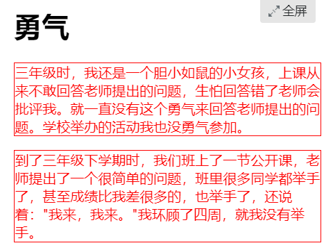

## 6-CSS的继承、层叠、特殊性

### CSS的继承性
> 继承是一种规则，它允许样式**不仅应用于某个特定html标签元素，而且应用于其后代**

```html
<!DOCTYPE HTML>
<html>
<head>
<meta http-equiv="Content-Type" content="text/html; charset=utf-8">
<title>继承</title>
<style type="text/css">
p{color:red;}
p{border:1px solid red;}
</style>
</head>
<body>
    <h1>勇气</h1>
    <p class="first">三年级时，我还是一个<span>胆小如鼠</span>的小女孩，上课从来不敢回答老师提出的问题，生怕回答错了老师会批评我。就一直没有这个勇气来回答老师提出的问题。学校举办的活动我也没勇气参加。</p>
    <p id="second">到了三年级下学期时，我们班上了一节公开课，老师提出了一个很<span>简单</span>的问题，班里很多同学都举手了，甚至成绩比我差很多的，也举手了，还说着："我来，我来。"我环顾了四周，就我没有举手。</p>
</body>
</html>
```
> `p{color:red;}` p标签及标签下的span的文本都变成红色，说明`color`这个样式具有继承性
>
> `p{border:1px solid red;}` 只为p标签所在的区域加框，不具备继承性



### 特殊性

标签的权值为1，类选择符的权值为10，ID选择符的权值最高为100

```css
p{color:red;} /*权值为1*/
p span{color:green;} /*权值为1+1=2*/
.warning{color:white;} /*权值为10*/
p span.warning{color:purple;} /*权值为1+1+10=12*/
#footer .note p{color:yellow;} /*权值为100+10+1=111*/
```
>**还有一个权值比较特殊--继承也有权值但很低，有的文献提出它只有0.1，所以可以理解为继承的权值最低**

```html
<!DOCTYPE HTML>
<html>
<head>
<meta http-equiv="Content-Type" content="text/html; charset=utf-8">
<title>特殊性</title>
<style type="text/css">
p{color:red;}
.first{color:green;}/*因为权值高显示为绿色*/

span{color:pink;}/*设置为粉色*/
p span{color:purple;}

</style>
</head>
<body>
    <h1>勇气</h1>
    <p class="first">三年级时，我还是一个<span>胆小如鼠</span>的小女孩，上课从来不敢回答老师提出的问题，生怕回答错了老师会批评我。就一直没有这个勇气来回答老师提出的问题。学校举办的活动我也没勇气参加。</p>
    <p id="second">到了三年级下学期时，我们班上了一节公开课，老师提出了一个很简单的问题，班里很多同学都举手了，甚至成绩比我差很多的，也举手了，还说着："我来，我来。"我环顾了四周，就我没有举手。</p>
</body>
</html>
```
> 加入`p span{color:purple;}`(weight=2)后`胆小如鼠`变为紫色，但是`.first{color:green;}`优先级=100？
>
>`p span`本身的权值确实是2，但是.first对`<span>胆小如鼠</span>`这四个字的影响力只有继承的权值，为0.1。所以2>0.1
