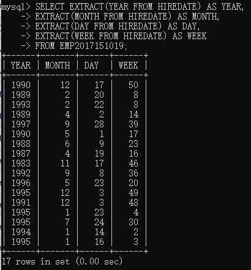

# EXERCISES4 DATES

## 尝试

### EXTRACT()
> EXTRACT() 函数用于返回日期/时间的单独部分，比如年、月、日、小时、分钟等等。

语法
> `EXTRACT(UNIT FROM DATE)`


**实例**
> 列举出`HIREDATE`的年月日周
```mysql
SELECT EXTRACT(YEAR FROM HIREDATE) AS YEAR,
EXTRACT(MONTH FROM HIREDATE) AS MONTH,
EXTRACT(DAY FROM HIREDATE) AS DAY,
EXTRACT(WEEK FROM HIREDATE) AS WEEK
FROM EMP2017151019;
```


### DATE_ADD()
> DATE_ADD() 函数向日期添加指定的时间间隔。

语法
> `DATE_ADD(date,INTERVAL expr type)`

单位同上表

**实例**
> 增加1年1月

```mysql
SELECT DATE_ADD(HIREDATE,INTERVAL 1 YEAR_MONTH) AS NEW_DATE
FROM EMP2017151019;
```


### DATE_SUB()
> DATE_SUB() 函数从日期减去指定的时间间隔

**同`DATE_ADD()`**

### DATEDIFF()
> DATEDIFF() 函数返回两个日期之间的天数。

语法
> `DATEDIFF(date1,date2)`

如果date1比date2晚，返回值为正，否则返回值为负

### DATE_FORMAT()
> DATE_FORMAT() 函数用于以不同的格式显示日期/时间数据。

[MySQL DATE_FORMAT() 函数](https://www.w3school.com.cn/sql/func_date_format.asp)

