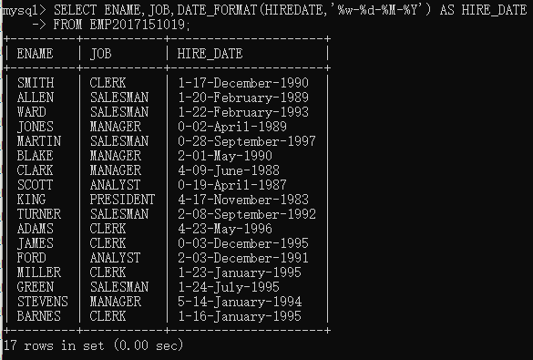

# EXERCISES4 DATES

## 尝试

### EXTRACT()
> EXTRACT() 函数用于返回日期/时间的单独部分，比如年、月、日、小时、分钟等等。

语法
> `EXTRACT(UNIT FROM DATE)`


**实例**
> 列举出`HIREDATE`的年月日周
```mysql
SELECT EXTRACT(YEAR FROM HIREDATE) AS YEAR,
EXTRACT(MONTH FROM HIREDATE) AS MONTH,
EXTRACT(DAY FROM HIREDATE) AS DAY,
EXTRACT(WEEK FROM HIREDATE) AS WEEK
FROM EMP2017151019;
```


### DATE_ADD()
> DATE_ADD() 函数向日期添加指定的时间间隔。

语法
> `DATE_ADD(date,INTERVAL expr type)`

单位同上表

**实例**
> 增加1年1月

```mysql
SELECT DATE_ADD(HIREDATE,INTERVAL 1 YEAR_MONTH) AS NEW_DATE
FROM EMP2017151019;
```


### DATE_SUB()
> DATE_SUB() 函数从日期减去指定的时间间隔

**同`DATE_ADD()`**

### DATEDIFF()
> DATEDIFF() 函数返回两个日期之间的天数。

语法
> `DATEDIFF(date1,date2)`

如果date1比date2晚，返回值为正，否则返回值为负

### DATE_FORMAT()
> DATE_FORMAT() 函数用于以不同的格式显示日期/时间数据。

[MySQL DATE_FORMAT() 函数](https://www.w3school.com.cn/sql/func_date_format.asp)

## NO.1-N0.5

### NO.1
> Select the name, job, and date of hire of the employees in department 20. (Format the HIREDATE column to MM/DD/YY) 

* `%y`实现2位制的年份
* `%m`实现两位值的月份
* `%d`实现两位制的日
```mysql
SELECT ENAME,JOB,DATE_FORMAT(HIREDATE,'%m/%d/%y') AS HIRE_DATE
FROM EMP2017151019
WHERE DEPTNO=20;
```


### NO.2
> Then format the HIREDATE column into DoW (day of the week), Day (day of the month), MONTH (name of the month) and YYYY(year)
* `%w` 周的天 （0=星期日, 6=星期六）
* `%d` 月的天，数值(00-31)
* `%M` 月名
* `%Y` 4位年

```mysql
SELECT ENAME,JOB,DATE_FORMAT(HIREDATE,'%w-%d-%M-%Y') AS HIRE_DATE
FROM EMP2017151019;
```


### NO.3
> Which employees were hired in April?

* `EXTRACT(UNIT FROM DATE)`可以筛选出需要的日期部分
    * `extract-提取`
```mysql
SELECT EMPNO,ENAME FROM EMP2017151019
WHERE EXTRACT(MONTH FROM HIREDATE)=4;
```

### NO.4
> Which employees were hired on a Tuesday?


### NO.5
> Are there any employees who have worked more than 30 years for the company?

## NO.6-NO.8
### NO.6
> Show the weekday of the first day of the month in which each employee was hired. (plus their names)

### NO.7
> Refine your answer to 7 such that it works even if an employee is hired after the last Friday of the month (cf Martin)
